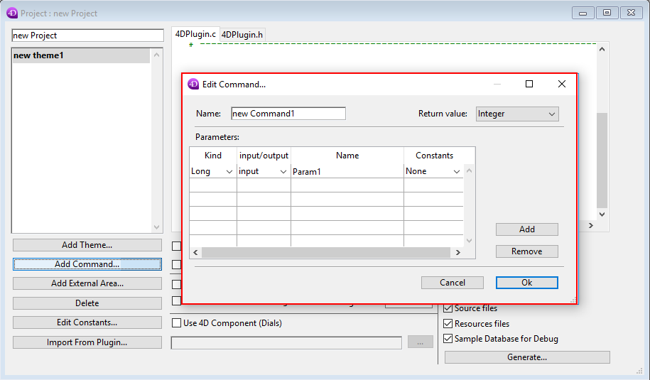
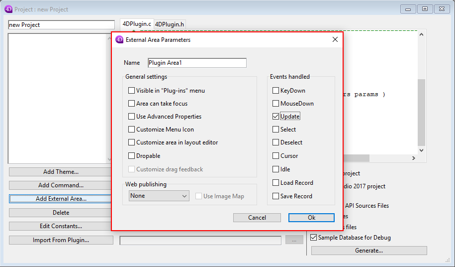
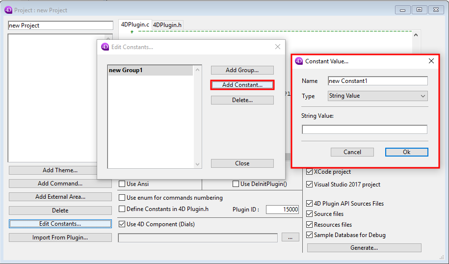
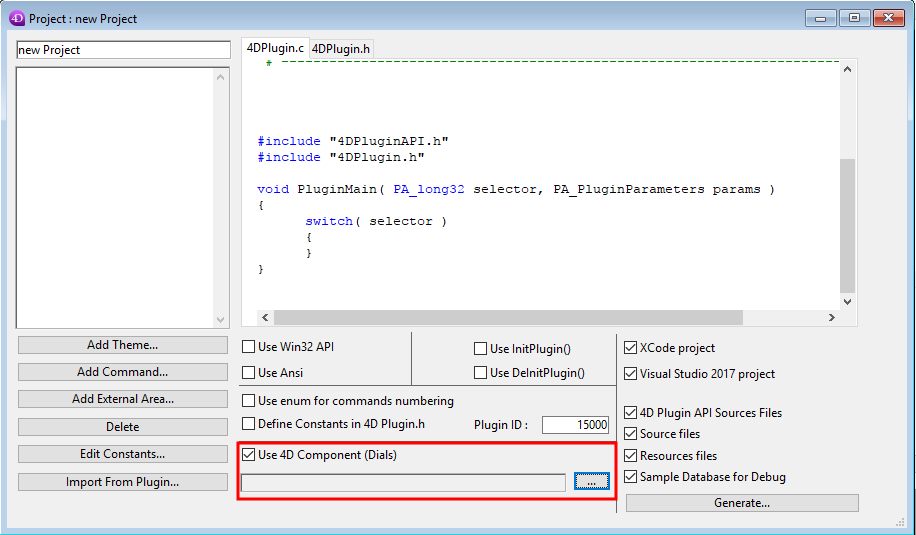
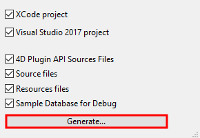

##  Plugin Wizard

The open source 4D Plug-in SDK is an essential tool that simplifies the task of developing 4D plug-ins. It writes the code 4D needs to correctly load a plug-in, allowing you to concentrate on your own code.

One of the strongest points in 4D is its ability to integrate plug-ins, written in C or C++ language. Plug-ins add to the richness of the 4D language and interface.

## Introduction

The fastest way to create a plug-in is by using the 4D plug-in Wizard tool. 4D plug-in Wizard is part of 4D plug-in SDK.

4D Plugin Wizard is an easy-to-use tool. The plug-in developer creates a project for the plug-in, then enters the desired names, parameters and returned values of the routines. He or she arranges the routines by theme or can tell the wizard to prepare the creation of an external area.

Once this is done, 4D Plugin Wizard generates all the necessary files: source files, export files, and project files (for both MacOS and Windows if necessary). The source code of the plug-in is generated, containing all necessary prototypes, constants, parameters, and code skeleton.

The 4D Plugin API files are also added in a "4D Plugin API" folder and are necessary for the plug-in to compile. These files consist of four headers, a source file and a definition file needed for Windows:

* 4DPluginAPI.h
* EntryPoints.h
* Flags.h
* PrivateTypes.h
* PublicTypes.h
* 4DPluginAPI.c
* 4DPluginAPI.def

Once 4D Plugin Wizard has generated the files, the developer can open the project and start to write the plug-in code. Each time he needs to use a 4D Plugin API function, he calls the appropriate routine, (stored in 4DPluginAPI.c) and is ready for compilation.

If the plug-in developer needs to change the syntax of a routine or add routines, etc., he can use 4D Plugin Wizard to generate the new resource file. He can also cut and paste parts of the new generated source code in the source code under development.

## Installation

```
git clone https://github.com/4D/4D-Plugin-SDK.git
```

Then open the *4dbase* file via 4D or by double clicking on the file.


## Structure of a plug-in

### Parameters and returned values

The main routine of the plug-in must be called `PluginMain`. When 4D calls the plug-in, it calls a routine named *FourDPack* under Windows and *Main* on Macintosh. FourDPack and Main are implemented in the 4DPluginAPI.c source file and call the `PluginMain` routine provided by your plug-in.

#### Parameters

A routine can receive up to 25 parameters. The parameters are received (among other things) in a PA_PluginBlock structure. A pointer to this structure (PA_PluginParameters) is passed to `PluginMain`.

4D Plugin API gives the developer utility functions to access the parameters, making it easy to get or set the value of a parameter: simply call the appropriate API function and then give it the number of the parameter you want to access. As parameters are passed by reference, it is also possible to change the value of a parameter. The syntax of those API functions are GetXXXParameter and SetXXXParameter, where XXX is the type of the parameter. Example: 
`PA_GetLongParameter`, `PA_SetLongParameter`, `PA_GetStringParameter`.

As an example, if a routine wants to read the value of parameters 3 that is a long, it can use:
```c
   aLong = PA_GetLongParameter(params, 3);
```
If a routine wants to set the value of parameter 2 that is a short, it can use:
```c
   PA_SetShortParameter(params, 2, aShort);
```
#### Returned values

Similar to parameters, the API gives the developer routines (PA_ReturnXXX) to return values of any kind. This must be used when the routine is declared as returning a value (in *4D Plugin Wizard*). If a routine returns a string, it needs to use `PA_ReturnString(parameters,theString)`.

### Skeleton of a plug-in source code

The `PluginMain` routine switches the selector value and calls a routine for each case, passing the PA_PluginParameters received to the routine. Each routine then deals with the parameters and the returned value.

Let's look at sample code of this dispatch as it can be generated by 4D Plugin Wizard.

```c
Void PluginMain( long selector, PA_PluginParameters params )
{
   switch( selector )
   {
      case 1:
         aRoutine( params ); 
         break;
      case 2:
         anotherRoutine( params );
         break;
   }
}
void aRoutine( PA_PluginParameters params )
{
   // Code of first routine. It expects a long and a string
   long   aLong;
   char   aString[256];
   // We get the parameters
   aLong = PA_GetLongParameter( params, 1 ); 
   PA_GetStringParameter( params, 2, aString );
   // . . . the code . . .
}
void anotherRoutine( PA_PluginParameters params )
{
   // Say this one returns a numeric value
   double   theDouble;

   // . . . the code . . .
   PA_ReturnDouble ( params, theDouble );
}
````

## How to add features via the plug-in Wizard

### Add new commands
Although the 4D language already contains one thousand commands, developers can use C or C++ to come up with more ways to enhance and extend its functionality. These plug-ins allow 4D applications to meet business-specific needs or to achieve complex integration with other environments.


To add a new command you need to firstly add (*Add a theme*) or select a theme. Then open the *Add a command*.



* **Name**: The name of the function
* **Return value**: The type of value returned (*None, Integer, Hour, Date, Long, Blob, Picture, Real, Text, Collection, Object)*
* **Parameters**: The parameters of the function created

```c
// ---------------------------------- new theme1 ----------------------------------
void new_Command1( PA_PluginParameters params )
{
	PA_long32 Param1;
	short returnValue;

	Param1 = PA_GetLongParameter( params, 1 );

	// --- write the code of new_Command1 here...
	PA_ReturnShort( params, returnValue );
}
```


### Add new interface tools
4D forms can create rich interfaces by embedding areas managed by a plug-in. You can create UI tools ranging from a simple graphic display to a more complex application such as a customized spreadsheet.



* **Name**: The name of the new area
* **General Settings**: The settings of the Area
* **Events handled**: The events sent to the plugin to be managed

Below is an example of the code generated:

```c
// -------------------------------- External Areas --------------------------------
void Plugin_Area1( PA_PluginParameters params )
{
	PA_AreaEvent event;
	PA_PluginProperties props;
	void* privateData;
	PA_Rect rect;
	switch ( event )
	{
	// --- Initialisation
		case eAE_InitArea :
			privateData = (void*) 1234;	// allocate here any private data for this instance of the area 
			PA_SetAreaReference( params, privateData );
			break;

	// --- Deinitialisation
		case eAE_Deinit :
			privateData = PA_GetAreaReference( params );
			// free any privateData allocated at init
			break;

	// --- Update and Scroll event
		case eAE_Update :
		case eAE_Scroll :
			rect = PA_GetAreaRect( params );
			// Draw the area here
			break;

		default  :
			PA_DontTakeEvent( params );
			break;

	}
}

```
### Add constants
It is possible to add constants via the plug-in wizard



After clicking on *Edits Constants* then adding a new Group (to group the constants), you can add a constant by adding its name, type and value.

Below is an example of code generated in the *4DPlugin.h* file if the box *Define constants in 4DPlugin.h* is set :
```c
// --- new Group1
#define new_Constant1	"Test"
``` 
Moreover the constants are added in the *constansts.xsf* file.

### Add components Dials

Enables to create dialog boxes in *4Dbase* format and call them from C++.


Select the checkbox **Use 4D component (Dials)** to copy the data from the selected folder



Example of code call it from C++:
```C
    PA_UniChar test[5]={'t','e','s','t',0); // "test": name of the dial
    PA_Dial4D dial = PA_OpenDialog(0, test, 1);
    PA_ModalDialog(dial,0)
```


### Code options
* **Use Win32 API**: adds a header for windows.
* **Use ANSI**: adds a header for IO.
* **Use InitPlugin**: adds a function called when the plugin is init.
* **Use DeInitPlugin**: adds a function called when the plugin is de init.

### How to use generated files

The plugin wizard generates projects compatible with XCode and Visual Studio 2017.
Just click on the button *Generate...* to create files in a specific folder.




#### Internal structure
The plugin Wizard generates multiple files ready to use, here is the general structure
```
│   4D Plugin-VS.sln //For visual studio
│   4D Plugin-VS.vcxproj
│   4DPlugin.cpp // Files generated
│   4DPlugin.h
│
├───4D Plugin API // The API code
│
├───4D Plugin.xcodeproj // For XCode on MAC
│
├───sample.4dbase // Project 4D to use
│   └───Plugins
```
*In the plugin:*
```
Plugins
└───4D Plugin.bundle
    └───Contents
        │   manifest.json
        │
        ├───Resources
        │   │   constants.xlf // Tokenized constants
        │   │
        │   └───Internal Components
        │           Dials.4dbase // Optional
        │
        ├───Windows
        │       4D Plugin.4DX // Executable Win32 
        │
        └───Windows64
                4D Plugin.4DX // Executable Win64

```
#### Manifest.json

The manifest file must be placed inside the "contents" folder of the plug in bundle.


*Keys*:
* *name* &rarr; plugin name
* *id* &rarr; plugin id (same as 4BNX)
* *commands* &rarr; is a array of commands, and is descibed with two keys:
    * *theme* &rarr; the theme name. For easy writing, this value can be a xliff resname , 4D will resolve xliff when loading the plugin.
    * *syntax* &rarr; the command syntax
    * *threadSafe* &arr; if true, sets the command to thread safe and can be used in a preemptive process (per default, the commands are not thread safe)
* *compiler variables* &rarr; is a string array

*Sample*:
```JSON
"name": "test plugin",
"id": 15000,
"commands": [
    {
       "theme": "",
       "syntax": "_test External"
    },
    {
       "theme": "testtheme1",
       "syntax": "command1(&L;&L):L"
    },
    {
      "theme": "System Commands",
      "syntax": "command2(&L;&L):L",
      "threadSafe": true
    }
  ],
  "compiler variables": ["test_var:D","test_var1:L","<>test_var2:L"]
}
```


#### Compilation

If the option is selected, a Visual Studio 2017 and XCode project are generated. These projects can be directly compiled either in 64bits or 32bits. 

#### Use a new plug-in in 4D

Create a folder **Plugins** in the root of 4D executable and copy the folder *4D Plugin.bundle* in it.

### Start with the API library
The 4D Plug-in API library, written in C, adds more than 400 functions that help you to easily create your own plug-ins. 4D Plug-in API functions manage all the interactions between the 4D application and your plug-in.

* **[Link to header ](https://github.com/4D/4D-Plugin-SDK/blob/master/4D%20Plugin%20API/4DPluginAPI.h)**


